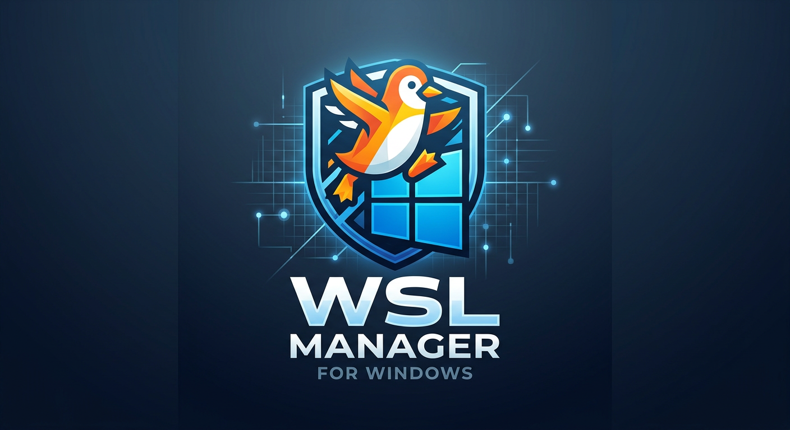

<p align="center">
  
</p>

<h1 align="center">WSL Manager</h1>

<p align="center">
  A modern desktop application for managing Windows Subsystem for Linux (WSL) distributions.
</p>

<p align="center">
  <a href="./README.zh-CN.md">🇨🇳 中文文档</a>
</p>

<p align="center">
  <a href="https://github.com/modiao2018/WSL-Manager/releases"></a>
  <a href="https://github.com/modiao2018/WSL-Manager/blob/main/LICENSE"></a>
  <a href="https://github.com/modiao2018/WSL-Manager/stargazers"></a>
</p>

---

## Features

- **List & Monitor** — View all WSL distributions with real-time status (Running / Stopped), disk usage, and creation date.
- **Start / Stop** — Start or terminate distributions with a single click.
- **Clone** — Duplicate an existing distribution via zero-copy pipe (export → import).
- **Import / Export** — Import from `.tar`, `.tar.gz`, or `.vhdx` files; export to `.tar`.
- **Open Terminal** — Launch Windows Terminal (or fallback to cmd) directly into the distribution.
- **Open in VS Code** — Open the WSL workspace in Visual Studio Code via Remote-WSL.
- **Open File Explorer** — Browse the WSL filesystem in Windows Explorer.
- **Hide / Unhide** — Hide distributions you don't need; toggle visibility at any time.
- **i18n** — Full internationalization support with Chinese and English.

## Screenshots

> *Screenshots coming soon.*

## Getting Started

### Prerequisites

- **Windows 10/11** with WSL enabled
- **Node.js** >= 18
- **npm** >= 9

### Download

Download the latest portable `.exe` from the [Releases](https://github.com/modiao2018/WSL-Manager/releases) page.

### Build from Source

```bash
# Clone the repository
git clone https://github.com/modiao2018/WSL-Manager.git
cd WSL-Manager

# Install dependencies
npm install

# Run in development mode
npm run dev

# Build production
npm run build

# Package portable exe
npm run dist
```

## Tech Stack

| Layer | Technology |
|-------|-----------|
| Framework | [Electron](https://www.electronjs.org/) 41 |
| Frontend | [React](https://react.dev/) 19 + [TypeScript](https://www.typescriptlang.org/) |
| UI Library | [Ant Design](https://ant.design/) 6 |
| Build Tool | [electron-vite](https://electron-vite.org/) + [Vite](https://vitejs.dev/) |
| i18n | [react-i18next](https://react.i18next.com/) |

## Project Structure

```
src/
├── main/              # Electron main process
│   ├── index.ts       # Window creation & app lifecycle
│   └── wsl-service.ts # WSL command wrapper & IPC handlers
├── preload/           # Preload script (contextBridge)
│   └── index.ts
└── renderer/          # React frontend
    └── src/
        ├── components/  # UI components
        ├── hooks/       # Custom React hooks
        ├── i18n/        # Internationalization
        ├── App.tsx      # Root component
        └── types.ts     # TypeScript type definitions
```

## Contributing

Contributions are welcome! Feel free to open an issue or submit a pull request.

## License

This project is licensed under the [MIT License](LICENSE).
